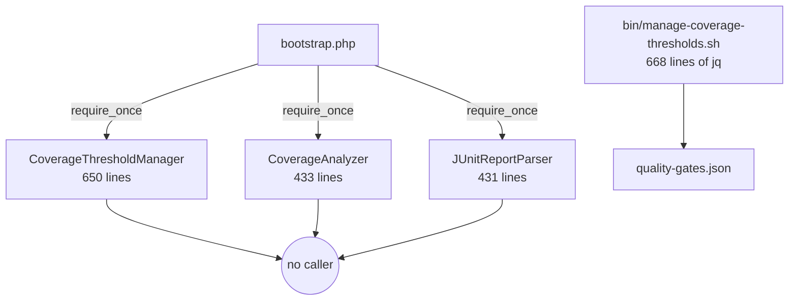
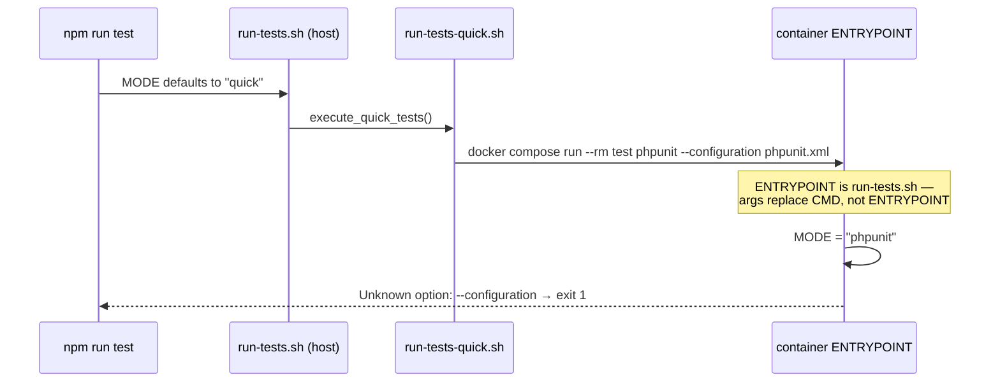
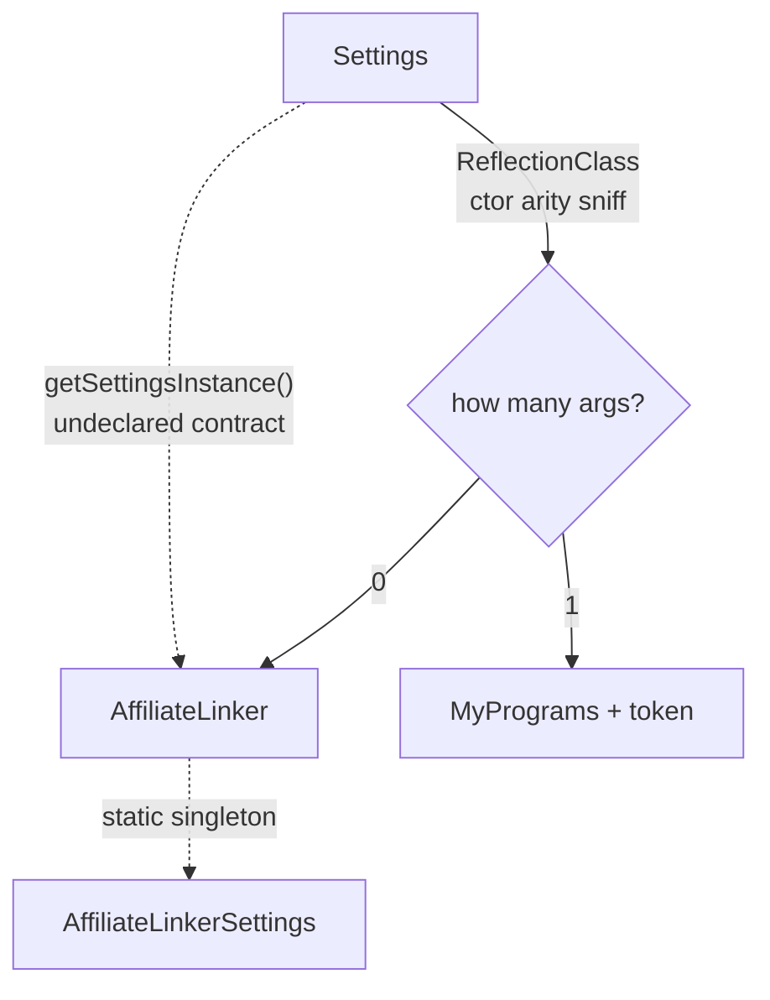

# Architecture Review — Deepening Candidates

**Status:** Review complete (no code changed)
**Date:** 2026-08-12
**Author:** Jared Loosli (with Claude)
**Rendered version:** https://claude.ai/code/artifact/3802e664-c7b5-4c67-a693-7e3505eaf133

## Scope and method

Nine candidates for turning shallow modules into deep ones, scoped to the hot spots
across the last 40 commits. Vocabulary follows the `codebase-design` skill: **module**,
**interface**, **depth**, **seam**, **adapter**, **leverage**, **locality**.

Line counts and `file:line` references were verified against the working tree on
2026-08-12. **Candidate 06 was reproduced by execution; every other finding is static
analysis** — worth confirming before acting on the larger ones.

**Paths.** `bin/…`, `docs/…` and `wp-content/…` are relative to the repo root. As
shorthand, `inc/…` and `tests/…` are relative to
`wp-content/themes/power-of-families/`, since most of the theme references live there.

| Area                                                   |  Lines |
| ------------------------------------------------------ | -----: |
| Theme modules (`inc/PowerOfFamilies`)                  |  1,685 |
| Bloom plugin (retired 2026-08-12 — see candidate 01)   |  2,681 |
| Test harness (seeders/reporting/fixtures/verification) |  4,073 |
| Actual `test-*.php`                                    |    535 |
| `bin/` scripts (28 files)                              | 10,754 |

## What is already sound

`HookRegistrar` (19 lines) is a well-placed seam — side-effect-free constructors, all
wiring in `register()`. Six theme modules are tested purely through it using
`has_action`/`has_filter`, and no test pokes `$wp_filter`. `GenesisStubs` is a real
adapter rather than a mock, and production code participates in that contract via the
`PHPUNIT_RUNNING` constant. These candidates extend that work; none of them undo it.

## Candidates at a glance

| #   | Candidate                                          | Strength        | Rough size        |
| --- | -------------------------------------------------- | --------------- | ----------------- |
| 01  | One Settings Screen module, not two copies         | **Closed**      | ~650 lines merged |
| 02  | Give the field definition a type                   | Strong          | new small module  |
| 03  | Delete the test-reporting module                   | Strong          | −1,514 lines      |
| 04  | Move the seeding harness off the PHPUnit bootstrap | Strong          | 2,799 lines moved |
| 05  | A shell library for `bin/`                         | Strong          | new `bin/lib`     |
| 06  | Split `run-tests.sh`'s two roles                   | **Confirmed**   | one file split    |
| 07  | Extract the program-description parser             | Strong          | new small module  |
| 08  | Declare the program contract, don't reflect on it  | Worth exploring | new interface     |
| 09  | Break up `POM_Bloom_Program`                       | **Void**        | 749-line class    |

---

## 01 — One Settings Screen module, not two copies

> **Closed 2026-08-12 by retirement, not extraction.** The open question below assumed two
> live consumers. There was one: the Bloom plugin is absent from `active_plugins` in the
> production snapshot and no workflow ever deployed it. The plugin was deleted instead of a
> shared module being built, so the "where does it live" question is moot. The security
> finding below was fixed in the surviving theme copy (`esc_url()` on the tab link); the
> plugin's raw `$_GET['tab']` drift went away with the deletion. See
> [the retirement spec](../superpowers/specs/2026-08-12-retire-bloom-plugin-design.md).
> Plugin code is recoverable at `git show ba01519:wp-content/plugins/pof-bloom-plugin/…`.

**Files**

- `wp-content/themes/power-of-families/inc/PowerOfFamilies/FieldRenderer.php` (318)
- `wp-content/themes/power-of-families/inc/PowerOfFamilies/Settings.php` (312)
- `wp-content/plugins/pof-bloom-plugin/includes/lib/class-pom-bloom-admin-api.php` (336)
- `wp-content/plugins/pof-bloom-plugin/includes/class-pom-bloom-settings.php` (328)

**Problem.** The same WordPress-settings module exists twice. Whitespace-normalised, only
**61 lines differ across ~654** — the same 12-branch field-type switch, the same variable
names, the same metabox plumbing.

**Solution.** One Settings Screen module behind one interface. Theme and plugin become two
adapters supplying field definitions and a token prefix.

**The drift is not cosmetic.** `Settings.php:185-197` gained a `get_current_tab()` that
whitelists the tab against known sections and runs it through
`sanitize_text_field(wp_unslash(…))`. The plugin's copy never received it —
`class-pom-bloom-settings.php:182-188` still assigns `$_POST['tab']` / `$_GET['tab']` raw.
Separately, the unescaped `add_query_arg()` interpolated into an `href` sits in **both**
copies unfixed (`Settings.php:286`, `class-pom-bloom-settings.php:263`).

**Wins.** Locality: hardening lands once. Leverage: one interface, two screens. Two
adapters genuinely justify the seam. Gives the plugin its first testable surface.

**Open question for implementation.** The theme and plugin deploy separately —
`.github/workflows/deploy.yml` rsyncs only the theme directory. A shared module needs a
home: a Composer package, a third plugin, or a declared dependency between the two. Settle
this before writing code.

---

## 02 — Give the field definition a type

**Files**

- `inc/PowerOfFamilies/Settings.php:137-171` — builds the shape
- `inc/PowerOfFamilies/Programs/AffiliateLinkerSettings.php:41-64` — builds the shape
- `inc/PowerOfFamilies/FieldRenderer.php:19-194`, `:249-316` — destructures it
- ~~`wp-content/plugins/pof-bloom-plugin/includes/lib/class-pom-bloom-admin-api.php` — destructures it again~~
  (deleted 2026-08-12 with the Bloom plugin — see candidate 01, so four readers remain, not five)

**Problem.** An untyped array shape
(`['id'=>…, 'label'=>…, 'type'=>…, 'options'=>…, 'default'=>…, 'placeholder'=>…]`) is the
real interface between five modules. Every reader re-derives it with scattered `isset()`
guards — and `FieldRenderer.php:74` reads `placeholder` with no guard at all, so a typo
degrades to a PHP notice rather than an error.

**Solution.** A `FieldDefinition` module that resolves defaults once and hands typed values
to renderer and persistence alike.

**Wins.** This is candidate 01's interface — do it first or alongside. Leverage: define
once, five readers. Testable without WordPress loaded.

---

## 03 — Delete the test-reporting module

**Files**

- `tests/reporting/CoverageThresholdManager.php` (650)
- `tests/reporting/CoverageAnalyzer.php` (433)
- `tests/reporting/JUnitReportParser.php` (431)
- `tests/bootstrap.php:81-83` — the only references in the repo

**Problem.** 1,514 lines with zero consumers anywhere — no test, no `bin/` script, no
workflow — yet `bootstrap.php` parses all three on every PHPUnit run. The threshold logic
was independently re-implemented in bash (`bin/manage-coverage-thresholds.sh`, 668 lines of
`jq`), which is the version actually wired to `npm run test:thresholds`.



**Solution.** Delete them. The deletion test comes back clean — no complexity reappears,
because the working implementation is the bash one.

**While you are there.** `bin/generate-html-coverage.sh:463-466` emits hardcoded example
coverage numbers referencing `Avanti/ThemeSetup.php`, a file that no longer exists after
the recent class renames.

> **Resolved 2026-08-12 by deletion (issue #68).** The fabrication was not confined to that
> one script: `bin/generate-coverage-dashboard.sh` carried an identical `loadCoverageData()`
> with its own hardcoded 76.5%, and neither file referenced `clover.xml` at all. Both were
> deleted — 1,609 lines — along with their callers. PHPUnit already writes a real HTML
> coverage report to `coverage/html` (`phpunit.xml`), so no capability was lost.
>
> The same investigation found the root cause of the 0% coverage reported alongside it:
> `xmlstarlet` is absent from the host and every extraction was written as
> `xmlstarlet … 2>/dev/null || echo "0"`, silently turning a missing binary into a zero.
> Actual coverage at the time was 27.92% (203/727 statements).

---

## 04 — Move the seeding harness off the PHPUnit bootstrap

**Files**

- `tests/verification/DatabaseIsolationVerifier.php` (749)
- `tests/seeders/{Enhanced,}TestDataSeeder.php`, `TestSeederConfig.php` (1,354)
- `tests/fixtures/TestFixtures.php`, `tests/factories/TestDataFactory.php` (696)
- `tests/bootstrap.php:75-80`

**Problem.** 2,799 lines load on every PHPUnit run, and **not one `test-*.php` references
any of it** — the tests use WordPress's own `$this->factory->user->create()` instead. The
only real callers are three `bin/` scripts: `seed-test-db.sh`, `test-dev-helper.sh`, and
`verify-test-isolation.sh`.

**Solution.** Put the seam where the callers are — one Test Database Fixture interface the
`bin/` scripts call, off the PHPUnit bootstrap entirely.

**Wins.** Bootstrap shrinks to stubs + WP. Two seeders collapse into one. Locality: seeding
truth in one module.

> **Tracked as #79 (2026-08-13).** Premise re-verified against `main`: all six files still
> present at exactly 2,799 lines, still required by the bootstrap, still referenced by no
> `test-*.php`. One correction — the bootstrap requires are at `tests/bootstrap.php:76-81`,
> not `:75-80`.

---

## 05 — A shell library for `bin/`

**Problem.** 28 scripts, 10,754 lines, and **zero `source` statements** — there is no
shared library to source. Repeated verbatim:

| Block                        | Copies                                     |
| ---------------------------- | ------------------------------------------ |
| Colour codes                 | 22 scripts                                 |
| `log_info`/`success`/`error` | ~20 scripts                                |
| mysqladmin wait loop         | 13 (7 in `bin/`, 6 inlined into workflows) |
| `TEST_DB_*` defaults         | 6 scripts                                  |

The wait loop exists in three mutually inconsistent variants, and the workflow copies
hardcode `root`/`password` inline.

**Solution.** One sourced `bin/lib/common.sh`. Start with `wait_for_db` and the loggers —
most copies, most drift.

**Also.** `bin/verify-db-isolation.sh` (174) and `bin/verify-test-isolation.sh` (317) are
the same isolation check, the second a strict superset — delete the first. Roughly 15 of
the 28 scripts appear in neither `README.md` nor `AGENTS.md`.

> **Tracked as #78 (2026-08-13), and it has grown.** Every figure above has moved: 25
> scripts / 8,772 lines (#66 and #71 deleted three), and all four table rows now measure
> colour codes in 20, loggers in 16, `mysqladmin` in 8 `bin/` scripts (the 6 inlined into
> workflows are unchanged) and `TEST_DB_*` in 8. Two duplicated blocks the review never
> counted now dominate the case —
> `clover_percentage()` in **5** scripts and `require_xmlstarlet()` in **3**. Both were
> duplicated knowingly while fixing #68, with comments pointing here, to keep those PRs
> scoped. Fixing a reporting bug made this candidate larger, which is the argument for it.

---

## 06 — Split `run-tests.sh`'s two roles

**Files**

- `bin/run-tests.sh` — host dispatcher (`package.json:25`) **and** container ENTRYPOINT
- `docker/test.dockerfile:44-52`
- `bin/run-tests-quick.sh:81`, plus ~9 sibling call sites

**Problem.** One file serves two callers whose argument contracts contradict each other.
Baked in as ENTRYPOINT, it intercepts every `docker compose run --rm test phpunit …` and
reads `phpunit` as a mode name.



**Confirmed by execution on 2026-08-12:**

```console
$ docker compose --profile testing run --rm --no-deps test phpunit --configuration phpunit.xml
Unknown option: --configuration
[usage dump]
exit 1
```

So `npm run test` — the command `AGENTS.md` documents — is broken today. CI stays green
only because every workflow reaches the suite through `ci`, the one mode satisfying both
contracts (verified separately: 34 tests, 80 assertions, green).

**Solution.** Two files, two interfaces. The container gets its own
`docker/entrypoint.sh`; the host dispatcher stops being shipped inside the image.

Only `package.json:23` clears `--entrypoint=''`, and only `bin/run-tests-ci.sh:221` passes
a valid mode — the other ~10 call sites are all affected.

---

## 07 — Extract the program-description parser

> **Closed 2026-08-13** as designed — `ProgramDescription` for the parse,
> `ProgramMembership`/`GroupsMembership`/`EnrolledProgram` for the Groups seam. See
> [`docs/superpowers/specs/2026-08-13-program-description-parser-design.md`](../superpowers/specs/2026-08-13-program-description-parser-design.md).
> Two things this analysis did not predict. The seam closed issue #41 without the Groups
> stubs that issue proposed as prerequisite work — the shortcode no longer touches Groups
> — so the stubs went in for a smaller job, covering the adapter. And reading Groups'
> source to get the shapes right exposed a live fatal in the extracted code:
> `Groups_User->groups` is `null`, not `[]`, for a user with no memberships, so the
> `array_map` over it was a PHP 8 `TypeError` on `/my-account/` for exactly the users the
> "no subscriptions" branch was written for. Static analysis of _our_ code could not see
> that; it needed the plugin's source.

**Files**

- `inc/PowerOfFamilies/Programs/MyPrograms.php` (120) — `:38-78 show_programs`, `:95-118 getCurrentUserPrograms`
- `tests/test-MyPrograms.php` (72) — `:16-20` `ReflectionMethod::setAccessible(true)`

**Problem.** All five tests use reflection to reach a **private** method
(`getProgramMetaFromDescription`); everything reachable through the shortcode or
`register()` is untested. `getCurrentUserPrograms()` instantiates `Groups_User` /
`Groups_Group` directly inside private logic, with no seam.

**Solution.** Promote the `key: value` description parsing to its own module with a public
interface, and put a seam in front of Groups so membership can be substituted.

**Wins.** The interface becomes the test surface. Reflection drops out of the suite.
Parsing becomes testable without WordPress.

---

## 08 — Declare the program contract instead of reflecting on it

**Files**

- `inc/PowerOfFamilies/Settings.php:96-105` (registry), `:112-130` (`loadActivePrograms`), `:163` (`getSettingsInstance`)
- `inc/PowerOfFamilies/Programs/AffiliateLinker.php:26-34` (static singleton)

**Problem.** `Settings` uses `ReflectionClass` to sniff constructor arity because the two
program modules have incompatible signatures, then calls `getSettingsInstance()` — a method
no interface declares. A program registered with `has-settings => true` but no such method
fatals.



**Solution.** A `Program` interface declaring construction and `settings()`. The reflection
branch disappears.

**Related, smaller.** Option/meta/hook/nonce keys are hand-typed literals with no shared
constants — `pof_active_programs`, `pof_affiliates_run` (three files, including inside a JS
string), `pof_save_meta`/`pof_meta_nonce` (twice in one file), `POF_Affiliate_Linker_CRON`
(three sites plus six in tests).

> **Tracked as #80 (2026-08-13), labelled `needs-triage` rather than `ready-for-agent`.**
> Structure re-verified; only line numbers moved, since #70 edited `Settings.php` — the
> registry is now at `:102-103`, the reflection sniff at `:123`, `getSettingsInstance()` at
> `:162-163`, and `AffiliateLinker`'s static singleton at `:9`/`:26`. This is the only
> remaining candidate touching production theme code, and the `has-settings => true` fatal
> is latent rather than live, so it wants a human decision on scope before an agent starts.
>
> **Split and the interface half done (2026-08-13).** The contract landed as `ProgramModule`
> in #85 — named that, not `Program`, because `EnrolledProgram` in the same namespace means
> a program a customer bought. The "related, smaller" paragraph above became #86, minus
> `pof_save_meta`/`pof_meta_nonce`, which no longer exist: they went with the Bloom
> retirement (#69). Two things this candidate did not predict, both from checking production
> rather than call sites: the live snapshot has only `My_Programs` active, so the changed
> path was unreachable there — and the affiliate-linker ajax button has never worked, since
> it demands a nonce no caller sends (#87).

---

## 09 — Break up `POM_Bloom_Program`

> **Void as of 2026-08-12.** The Bloom plugin was retired (see candidate 01), so this class
> and its 18 partials no longer exist. Nothing to break up.

**Files**

- `wp-content/plugins/pof-bloom-plugin/includes/class-pom-bloom-program.php` (749)
  — `:106-243 ajax_callback`, `:330-342 get_partial`, `:552-748 setup`
- `wp-content/plugins/pof-bloom-plugin/assets/partials/*.php` (18 files)

**Problem.** One 749-line class is router, AJAX endpoint, view-model builder and HTML
generator:

- `setup()` is a ~200-line route table whose `vars` keys are closures running their own DB queries
- `ajax_callback()` is a ~140-line switch on `$_POST['route']` mixing sanitisation, persistence and JSON output
- `format_questionaire_hierarchy()` hand-builds `<table>` markup
- `get_partial()` uses `extract($vars)` — and because `$vars` survives extraction, partials read data two different ways at random (`nav.php` uses `$vars['active']`; `overview.php` uses bare `$current_user`)

Zero tests; the plugin is not even in the coverage `<include>` universe.

**Solution.** Pull `Goalset` and `Assessment` out as domain modules first; leave routing and
rendering thin on top. Characterisation tests before anything moves.

**Dead and broken code found along the way.** The `conversion` route (`:743-745`) has no
`vars` key while `page()` dereferences it unconditionally, and `conversion.php` calls nine
`$this->` methods that exist nowhere in the codebase. `POM_Bloom::update()` holds a
`CREATE TABLE bloom_assessments` that is never invoked — assessments actually live in user
meta.

---

## Recommended order

**06 → 03 → 02 → 01 → 07**

Candidate 01 is the biggest prize, but both copies are untested, and collapsing two
near-identical 650-line modules without a test command you trust is how the drift arrived
in the first place. Fix the test seam first — it is small, mechanical, and no longer
hypothetical. Then 03 is a free deletion clearing 1,514 dead lines out of the bootstrap,
02 defines the interface that 01 needs, and 01 collapses the copies behind it.

> **Superseded 2026-08-12.** 06, 03 and 01 have landed; 09 is void. 01 did not need 02 in
> the end, because it was closed by deleting the second copy rather than merging the two —
> the ordering argument above only held while an extraction was the plan. What remains is
> **02 → 07 → 04/05 → 08**.
>
> **This document is no longer the backlog (2026-08-13).** Every candidate is now done,
> void, or filed. Those issues carry the live state and re-verify each premise against
> `main`; this file stays a dated snapshot of the original analysis. Where the two disagree,
> the issue is right — candidate 05 in particular has grown since this was written.
>
> | Candidate                                  | Outcome                                   |
> | ------------------------------------------ | ----------------------------------------- |
> | 01 collapse the duplicated Settings Screen | done — #69, by retiring the plugin        |
> | 02 type the field-definition array         | done — #70                                |
> | 03 delete `tests/reporting/`               | done — #66                                |
> | 04 seeding harness off the bootstrap       | **open — #79**                            |
> | 05 shared `bin/lib/common.sh`              | **open — #78**                            |
> | 06 split `run-tests.sh`'s two roles        | done — #67                                |
> | 07 extract the program-description parser  | done — #72, closing #41                   |
> | 08 declare the program contract            | interface done — #85; keys **open — #86** |
> | 09 break up `POM_Bloom_Program`            | void — plugin retired by 01               |
>
> This table is temporary: once 04, 05 and 86 close, `gh issue list` is the only thing worth
> reading. Work found by _running_ the tooling rather than reading it — #73, #74, #76 — was
> never part of this review and lives only in the tracker.

> **Updated 2026-08-13.** 02 and 07 have landed too. What remains is **04/05 → 08**, and
> 04/05 should follow issue #68's reporting work — both touch `bin/` and the PHPUnit
> bootstrap.

## Domain terms

No ADRs were contradicted — `docs/adr/` and `CONTEXT.md` do not exist yet.
`AGENTS.md` notes that producer skills create them lazily, so the terms these candidates
name are the natural first entries: **Settings Screen**, **Field Definition**, **Program**,
**Goalset**, **Assessment**.
