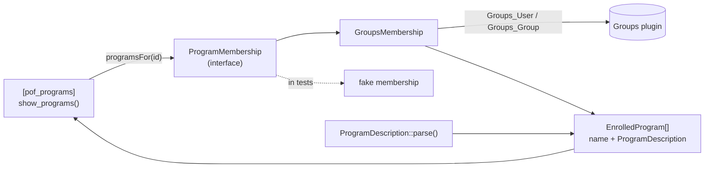

# Extract the Program-Description Parser — Design

**Status:** Implemented on `worktree-extract-program-description`; suite green at 112 tests / 282 assertions (from 80 / 225)
**Date:** 2026-08-13
**Author:** Jared Loosli (with Claude)
**Implements:** Candidate 07 of [`docs/architecture/2026-08-12-deepening-review.md`](../../architecture/2026-08-12-deepening-review.md), and closes [issue #41](https://github.com/jloosli/power-of-families/issues/41)

## Problem

`inc/PowerOfFamilies/Programs/MyPrograms.php` is one 120-line class doing four
unrelated jobs: registering hooks, asking the Groups plugin what the current user
belongs to, parsing a `key: value` block out of each group's `description` column,
and rendering the shortcode's markup.

Two of the four have no seam, so the test suite can only reach one of them:

- **The parser is private.** All five tests in `tests/test-MyPrograms.php` reach
  `getProgramMetaFromDescription()` through `ReflectionMethod::setAccessible(true)`.
  That covers the #39 regression (a NULL group description fatalling `/my-account/`)
  but nothing about how the parsed values are used.
- **Groups is instantiated inline.** `getCurrentUserPrograms()` does
  `new \Groups_User($user_id)` and `\Groups_Group::get_groups()` from inside private
  logic. There is no way to make the current user belong to a program under PHPUnit,
  so `show_programs()` — every escape, every branch, the whole public surface — is
  untested. Issue #41 filed exactly this, and parked it because stubbing Groups
  looked like more setup than the regression fix warranted.

The shape the two halves pass between them is also undeclared. `Groups_User->groups`
yields `Groups_Group` objects that must be unwrapped via `->group`, while
`Groups_Group::get_groups()` returns raw `$wpdb` rows already. The adapter reconciles
that asymmetry today with an `array_map`, and then `show_programs()` reads `->name`
and `->description` off whatever came back.

## Scope

Theme only, `PowerOfFamilies\Programs` namespace. Four new files, all small; no
change to `Settings`, so candidate 08's reflection-based registry is untouched.

### Non-goals

- **Candidate 08.** `MyPrograms` keeps a constructor whose first parameter is the
  token, so `Settings::loadActivePrograms()`'s arity sniff keeps working unchanged.
- **Moving `GROUPS_ADMINISTRATOR_OVERRIDE`.** `register()` still defines it. It is a
  Groups-plugin global that changes access checks plugin-wide, not just here, so
  relocating it into the membership adapter would shift behavior outside this class.
  The adapter reads it with the same `defined()` guard it has today.
- **Reworking the markup.** `show_programs()` emits the same HTML, escape for escape,
  with one exception: the program image gained `alt=''` (Copilot review), which changes
  nothing about layout.

    Deliberately _not_ fixed: the unbalanced extra `</div>` after the program list, filed
    as [issue #73](https://github.com/jloosli/power-of-families/issues/73). A stray closing
    tag is not inert — the parser applies it to the nearest open ancestor, so removing it
    changes the DOM nesting of a page that has shipped this way for years, and production
    CSS may be sitting on the current structure. That wants a rendered before/after on
    `/my-account/`, not a line-deletion inside a refactor.

## Design

### `ProgramDescription` — the parser, as its own module

```php
final readonly class ProgramDescription {
    public static function parse(?string $description): self;
    public function get(string $key): ?string;
    public function image(): ?string;
    public function home(): ?string;
}
```

A group description is a newline-separated list of `key: value` pairs. Keys are
lowercased; the first colon splits, so a value may contain colons (every value in
production is a URL). Lines with no colon, and lines with an empty key, are not
pairs and are skipped. A repeated key takes its last value.

`get()` returns `null` for a key that is absent **and** for a key whose value is
blank — `home:` with nothing after it is the same as no `home` at all. That is not a
behavior change: the old code stored `''` and the render site then filtered it
through `!empty()`. Folding the two into one absent-ness test moves the decision to
where the parse happens and lets the render site ask one question instead of two.

`image()` and `home()` exist because they are the only two keys anything reads. They
name the contract the shortcode depends on; `get()` remains for the open-ended rest.

Being `?string`-returning methods over a private map rather than public properties is
deliberate — the key set is data, not API, so a dynamic-property object (today's
`\stdClass` with `$meta->{$attr} = $val`) invites `isset()` at every reader. This is
the same move candidate 02 made for field definitions: resolve absence once at the
boundary so no reader guards.

**One deliberate difference from the old parser.** It did
`array_map('trim', explode(':', $line))` and rejoined with `':'`, so whitespace
around a _second_ colon was eaten — `home: https://x/a: b` parsed to
`https://x/a:b`. Splitting on the first colon only, then trimming the two halves,
preserves the value as written. No production description depends on the old
behavior, and a test pins the new one.

### `EnrolledProgram` — the shape crossing the seam

```php
final readonly class EnrolledProgram {
    public function __construct(
        public string $name,
        public ProgramDescription $description,
    ) {}
}
```

The name is _not_ `Program`: candidate 08 wants that name for the interface a program
_module_ implements (`AffiliateLinker`, `MyPrograms`). This is the other thing — a
program a user is enrolled in.

The value object is what makes the seam substitutable. Returning bare Groups objects
would mean a test double has to reproduce Groups' two-level wrapping to be accepted;
returning `EnrolledProgram` means it hands over a name and a parsed description.

### `ProgramMembership` — the seam in front of Groups

```php
interface ProgramMembership {
    /** @return EnrolledProgram[] */
    public function programsFor(?int $userId = null): array;
}
```

`GroupsMembership` is the only production implementation, and it holds everything
`getCurrentUserPrograms()` held: the `class_exists('Groups_User')` check (Groups may
not be active), the administrator-override branch, the `->group` unwrap, and now the
mapping to `EnrolledProgram`.

Reading Groups' source to get those shapes right turned up a **latent fatal in the
code being extracted**, of exactly issue #39's kind:

```php
$user_groups = $groups_user->groups;                    // null, not [], for zero groups
$the_programs = array_map(fn($g) => $g->group, $user_groups);   // TypeError in PHP 8
```

`Groups_User::__get('groups')` initialises its result to `null` and only assigns an
array when the membership query returns rows (`class-groups-user.php:497-514`), so it
answers `null` both for a user who belongs to no groups and for a user id Groups
cannot resolve. `array_map()` over `null` is a `TypeError` on PHP 8 — the same
`/my-account/` fatal #39 was, reachable by any logged-in non-administrator with no
memberships. The adapter normalises a non-array to `[]`, and
`test_user_with_no_memberships_gets_no_programs` pins it.

It also drops rows that are not objects. `new Groups_Group($id)` sets its public
`$group` to `false` when the id no longer resolves, so a stale row in
`wp_groups_user_group` currently reaches `show_programs()` as `false` and gets read
for `->description`; `Groups_Group::get_groups()` likewise answers `null` on a query
failure. Filtering at the adapter keeps both a non-event.

`MyPrograms::__construct(?string $token = null, ?ProgramMembership $membership = null)`
defaults to `new GroupsMembership()`, so nothing at the call sites changes.

**The answer is a function of the argument** (tightened during review). Copilot pointed
out that `if (!$userId)` treats a literal `0` — WordPress for "nobody" — the same as the
`null` the interface documents as "use the current user". Pulling that thread found the
same confusion one level down: the override branch asked `current_user_can()`, so an
administrator asking about someone else's enrolment got told about every group. Both now
key off the user passed in: `null === $userId` for the sentinel, `user_can($userId, …)`
for the override. Production is unaffected — its one call site asks about the current
user, where the two agree — but this is an interface that takes a user id, and it should
not answer for a different one.



## Tests

Reflection drops out of the suite entirely.

| File                            | Covers                                                                                                                                                             |
| ------------------------------- | ------------------------------------------------------------------------------------------------------------------------------------------------------------------ |
| `tests/test-ProgramDescription` | the parser through its public interface: null, empty, image+home, colon-bearing values, blank values, duplicate keys, keyless lines, CRLF                          |
| `tests/test-MyPrograms`         | `do_shortcode('[pof_programs]')` for all four branches — logged out, logged in with none, NULL description, populated description — via a fake `ProgramMembership` |
| `tests/test-GroupsMembership`   | the adapter against `tests/stubs/GroupsStubs.php`: Groups absent, administrator override, the `->group` unwrap, stale rows dropped                                 |

The fake membership is what closes issue #41 without the Groups stubs the issue
proposed as step 1 — the shortcode no longer touches Groups. The stubs are still
worth having, but for a smaller job: covering `GroupsMembership` itself, which is now
the one place a Groups shape change can break `/my-account/`.

The parser tests include the two live group descriptions verbatim from the production
dump. Between them they carry CRLF endings, a capitalised `Image:`, a `store:` key
nothing reads, relative URLs, and a hand-editing mistake that repeats `image` and
folds a second `home:` into `store` — so the parse rules above are pinned against the
data they actually run on, not only against invented input.

Two gaps stated rather than papered over:

- **The "Groups is not installed" branch is uncovered.** The stubs define
  `Groups_User` for the whole suite and a class cannot be unloaded. The branch is one
  `class_exists()` guard returning `[]`.
- **`GROUPS_ADMINISTRATOR_OVERRIDE` is defined in the stubs**, mirroring what
  `register()` does in production. Without it the administrator-override branch is
  unreachable, and relying on some other test having called `register()` first would
  make the suite order-dependent.

New test files must be listed in the theme's `phpunit.xml`; the suite enumerates
`<file>` entries rather than globbing, and the root `phpunit.xml` is stale.

## Wins

- The interface is the test surface. `show_programs()` goes from untested to 15 cases;
  the suite goes from 80 tests / 225 assertions to 112 / 282. Reflection is gone.
- Parsing is a pure function of a string, testable without Groups and without WordPress.
- Groups' two-shape asymmetry is stated once, in the adapter, instead of implied by an
  `array_map` in the middle of a private method — and looking straight at it is what
  surfaced the zero-memberships fatal.
